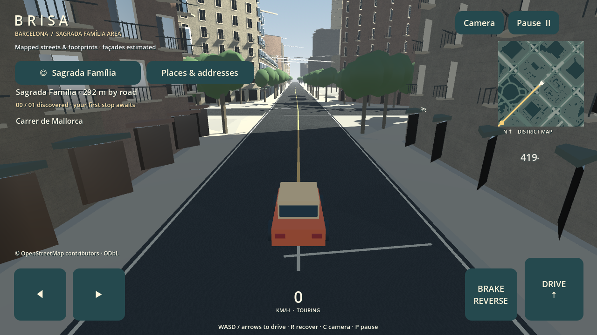

# Brisa — Eixample streets

An offline Godot 4.5 driving prototype using **real OpenStreetMap roads, building footprints, place records and address tags** around Sagrada Família. The earlier fictional grid has been replaced.



## What is accurate, and what is not

The current bounded pilot covers **about 0.72 km² around Sagrada Família**, not all of Eixample. Source coordinates and street names are retained, projected into metres with east = +X and north = −Z. The road graph respects imported one-way tags and excludes pedestrian-only/private roads from routing. Road surfaces also display mapped paths.

The snapshot contains 1,048 building records, 540 shops/cafés/restaurants and other selected places, 1,667 address records, 1,021 tree points and seven parks. **292 places have both a street and house number recorded.** Unknown address fields remain unknown. The 2,930 rendered road/path segments include 616 routable segments; they are not 2,930 distinct streets. 800 building heights are based on OSM height or floor-count tags; floor counts are converted using an estimated floor height.

This is **not a photorealistic digital twin or a live city feed**. Detailed façades, balconies, storefront appearance, missing heights, lane widths/markings, kerbs and street furniture are generated estimates. Sagrada Família occupies its mapped location/footprint but its upper structure is still an illustrative model. Terrain is flat. Shop names and addresses are source records, not independently verified current tenants. Some record edits are years old; a fresh download is not a fresh survey. Turn-restriction relations, traffic laws/signals, real pavement elevations, complex roofs and surveyed building interiors are not implemented.

The visual upgrade adds plaster PBR textures, glass reflections, façade trims/balconies, sourced shop-name labels, mapped tree placement, asphalt grain, sun shadows and distance-limited detail. It improves the old block style but does not match Google Maps photogrammetry or scanned street-level façades.

## Run locally

1. Install the standard [Godot 4.5 stable](https://godotengine.org/download/archive/4.5-stable/) editor.
2. Import `project.godot` and press **F5**. Initial procedural geometry creation takes longer than the old small grid.
3. Follow the gold route to Sagrada Família and stop near the arrival ring. Choose **Places & addresses** to search records and route to the closest mapped road near a shop.

Temporary development engine (not bundled or guaranteed to survive reboot):

```sh
/tmp/barcelona-godot/Godot.app/Contents/MacOS/Godot --path /Users/hahneyshkondeti/Documents/ChatGPT/Explorer
```

| Input | Action |
| --- | --- |
| W / Up / DRIVE | Accelerate |
| S / Down / Space / BRAKE | Brake; hold after stopping to reverse |
| A / D or Left / Right | Steer |
| C / Camera | Reset chase camera |
| R / pause menu recovery | Recover to last safe mapped road |
| P / Escape / Pause | Pause/resume |
| Places & addresses | Search place/name/street/house number; inspect source dates; route nearby |

The north-up minimap uses real geometry and follows the car. Multi-touch driving, pause, audio, 30/60 FPS caps and local saves remain. The previous fictional map's save is invalidated by the new district ID rather than restoring its coordinates into an unrelated map.

## Refresh roughly weekly

Run from the repository using Python 3 and system `curl`; there are no Python package dependencies or API keys.

```sh
python3 tools/refresh_map.py --check
python3 tools/refresh_map.py --download
python3 tests/check_map.py --candidate data/.refresh/eixample.json
python3 tools/refresh_map.py --apply
```

`--check` is offline and reports whether the snapshot is at least seven days old. `--download` makes one bounded OSM API request and stages the result. It does not alter the working map. `--apply` rebuilds from the staged source, verifies consistency, rejects large unexpected coverage/count changes, retains the previous JSON, and atomically replaces the runtime JSON. If a step fails, keep the current snapshot and inspect the reported failure. Reopen the desktop game after an update.

This is a **developer-run refresh pipeline**, not a scheduled job or automatic download on the iPhone. To update an installed iPhone in this version, rebuild/reinstall the app with the new packaged snapshot. An in-app data-pack update channel needs a separate distribution mechanism and is not implemented. Data remains fully offline between updates. Weekly refreshes may return unchanged or incomplete shop information.

Source data and transformation are included: `data/source/eixample.osm.gz`, `data/eixample.json`, `tools/import_map.py`. Preserve [OSM attribution and ODbL terms](data/LICENSE.md) when distributing. No Google imagery is downloaded or used.

## Physical iPhone build

The chosen product baseline is **iPhone 11 / A13, iOS 16.0 or later**, landscape, 30 FPS target. A 60 FPS cap is selectable. This remains a target to revalidate after the real-map/detail upgrade, not a measured performance guarantee. Older phones may install but are outside the intended support baseline.

1. Install **full Xcode** on a Mac and finish its first-launch setup, including the iOS platform. Command Line Tools alone cannot build this app. In Xcode → Settings → Locations select the full Xcode command-line tools.
2. Install **Godot 4.5 stable** and its matching export templates using Editor → Manage Export Templates. Keep editor and template versions aligned.
3. In Godot, open Project → Export → **iOS**. The checked-in preset sets the bundle ID `com.hahneyshkondeti.brisa`, arm64, iPhone device family, minimum iOS 16, and project-only export. Change the bundle ID if your signing setup needs a different one.
4. Enter **your actual Apple Team ID** in the iOS preset. It is intentionally blank in this repository. Do not commit private credentials or provisioning profiles.
5. Export the project into `build/ios/` (create this directory if needed). Open the generated `.xcodeproj` in Xcode. If Godot flags missing icons, assign your original app icons in the preset; the prototype uses the engine's default icon fallback until branded icons are supplied.
6. In Xcode, choose the app target → Signing & Capabilities, select your team, and enable automatic signing. Verify the deployment target is 16.0, landscape orientations are enabled and the device family is iPhone. Check that Xcode offers both landscape orientations if desired.
7. Connect and trust your iPhone. Enable Developer Mode on the phone if requested. Choose it as the run destination and press Run. Personal-team signing can be used where supported by your account; distribution/TestFlight requires Apple's applicable membership/signing setup.
8. After installation, enable Airplane Mode and verify launch, driving, landmark discovery, background/resume and relaunch-save restoration. Profile the baseline hardware before calling it supported.

Official instructions: [Godot 4.5 iOS export](https://docs.godotengine.org/en/4.5/tutorials/export/exporting_for_ios.html). Godot generates the Xcode project at export time; there is no hand-maintained Xcode project in this repo.

**Current environment limitation:** full Xcode, the iOS SDK, matching iOS export templates and Apple signing are not configured here. No physical device build, simulator run, signing validation or iPhone performance test has been performed.

## Components and performance

- `scripts/district.gd`: loads the dated snapshot, metric coordinates, nearest-road recovery and map bounds.
- `scripts/world_builder.gd`: builds footprint walls/collision, roads, materials, signage, trees and illustrative upper landmark geometry.
- `scripts/navigation.gd`: directed A* graph routing with source-segment endpoints; same-segment routes obey one-way tags.
- `scripts/hud.gd`, `scripts/minimap.gd`: landscape controls, real-map minimap and offline place/address browser.
- `scripts/car.gd`, `scripts/chase_camera.gd`, `scripts/drive_input.gd`: arcade driving, obstruction-aware camera and input.
- `scripts/save_store.gd`, `scripts/landmarks.gd`, `scripts/engine_audio.gd`: saves, discovery and synthesized engine sound.
- `tools/import_map.py`, `tools/refresh_map.py`: reproducible ingestion and validated snapshot updates.

Materials are shared; wall surfaces and instanced details are grouped into 100 m cells. Façade details disappear beyond 180 m and trees/trim beyond 420 m. One sun casts shadows over the nearest 110 m. Mesh walls provide footprint-aligned collision, with simplified flat terrain and perimeter barriers. No real-time traffic, streaming city chunks or full-district memory budget is implemented. The new dataset is materially larger; physical iPhone profiling is still required.

## Verify

```sh
python3 tests/check_map.py
GODOT=/tmp/barcelona-godot/Godot.app/Contents/MacOS/Godot
"$GODOT" --headless --path . --editor --import --quit
"$GODOT" --headless --path . --fixed-fps 60 --script tests/smoke.gd
"$GODOT" --path . --script tests/capture.gd
```

See [verification notes](docs/TESTING.md) and [asset provenance](ASSET_LICENSES.md). Tests use separate saves. The smoke suite now physically drives from the start to the landmark instead of teleporting for its end-to-end arrival check.

## Next toward a real city experience

Profile/tune the pilot on the baseline iPhone first. Source licensed street-level façade photographs or commissioned photogrammetry for a small verified corridor, match storefronts to dated surveys, and replace the illustrative basilica with an accurate licensed model. Expand the map in streamed chunks across Eixample, add authoritative street/address joins and terrain elevations, and build an optional signed data-pack update channel. These are the remaining steps toward the requested photographic city fidelity; map records alone cannot supply it.
